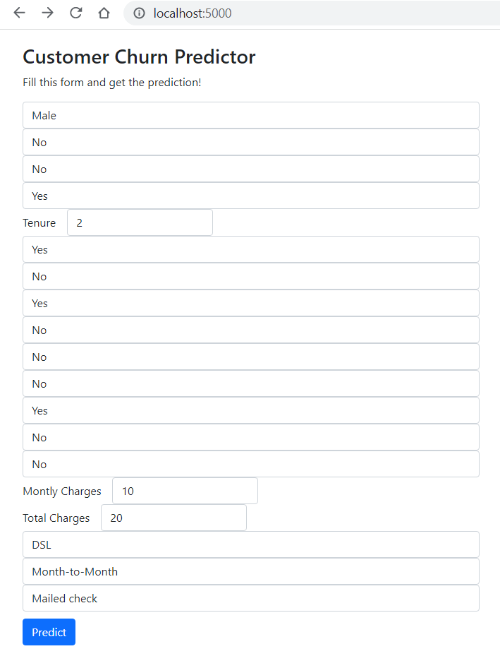
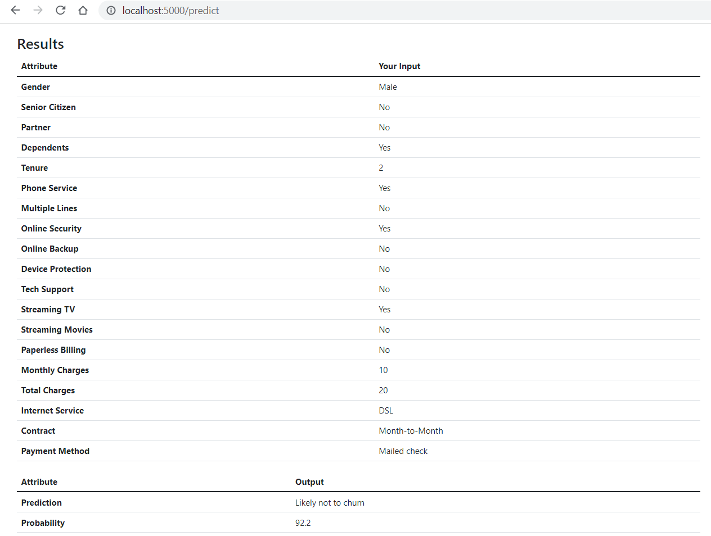

# Customer Churn Prediction
Customer churn (aka customer attrition) occurs when customers or subscribers stop doing business with a company or service. 
It is a critical metric because it is much less expensive to retain existing customers than it is to acquire new customers.

This model predicts if a customer is likely to churn or not. 
The dataset has been taken from <a href="https://www.kaggle.com/blastchar/telco-customer-churn">Kaggle</a>.
A neural network with 2 hidden layers has been implemented using Keras. 

The model has been made into a Flask web application. Install flask (using, say <code>pip install flask</code>), and run the server by executing <code>app.py</code> file. Then open up port <a href="http://localhost:5000/">5000</a> on a browser and proceed.

